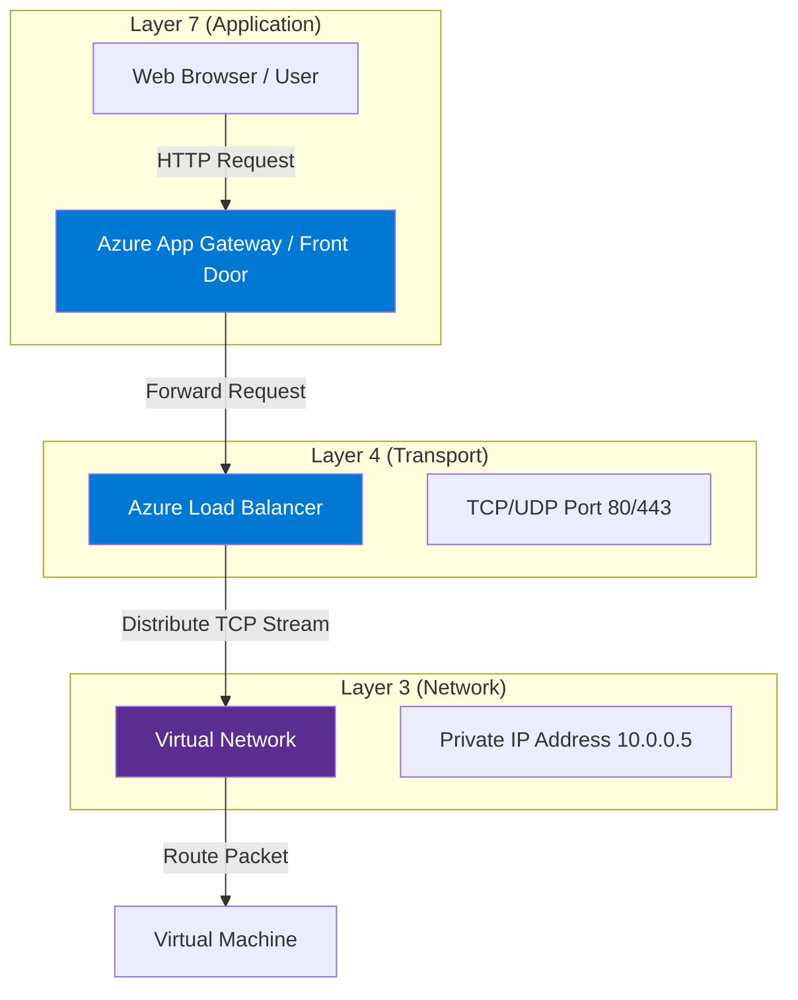

# 🌐 OSI Model (Open Systems Interconnection)

## 📌 Overview

The **OSI Model** is a conceptual framework used to understand how data travels across a network. It breaks down network communication into **7 abstract layers**.

> **Mnemonic**: **P**lease **D**o **N**ot **T**hrow **S**ausage **P**izza **A**way
> (Physical, Data Link, Network, Transport, Session, Presentation, Application)
>
> **Hindi Mnemonic: A**ndhra **P**radesh **S**e **T**rain **N**ayi **D**elhi **P**ahuchi
> (Application, Presentation, Session, Transport, Network, Data Link, Physical)

---

## 1. The 7 Layers & Azure Mapping

| Layer  | Name             | Unit of Data | Function                             | Azure Component                         |
| :----- | :--------------- | :----------- | :----------------------------------- | :-------------------------------------- |
| **L7** | **Application**  | Data         | End-user interface (HTTP, FTP, SMTP) | **Application Gateway**, **Front Door** |
| **L6** | **Presentation** | Data         | Encryption, Compression (SSL/TLS)    | **SSL Termination**                     |
| **L5** | **Session**      | Data         | Session management                   | TCP Sessions                            |
| **L4** | **Transport**    | Segment      | Reliability, Ports (TCP/UDP)         | **Azure Load Balancer**                 |
| **L3** | **Network**      | Packet       | Routing, IP Addressing               | **Virtual Network (VNET)**, **NSG**     |
| **L2** | **Data Link**    | Frame        | MAC Addressing, Switching            | Virtual Switch (Managed by Azure)       |
| **L1** | **Physical**     | Bit          | Cables, Fiber, Wireless              | Physical Data Center Hardware           |

---

## 2. Deep Dive: The 7 Layers Explained (Hinglish)

### **Layer 7: Application Layer (Sabse Top Layer)**

- **Technical**: The layer where the user interacts with the application. It provides protocols like HTTP, SMTP, FTP.
- **Hinglish**: Yeh woh layer hai jahan hum directly interact karte hain using apps like Chrome, Outlook, ya Skype. Jab aap browser mein "google.com" type karte ho, toh Application Layer active hoti hai.
- **Azure Example**: **Azure Application Gateway** (Web traffic handle karta hai).

### **Layer 6: Presentation Layer (Translator)**

- **Technical**: Responsible for encryption, decentryption, compression, and translation (e.g., ASCII to EBCDIC).
- **Hinglish**: Iska kaam hai data ko us format mein convert karna jo receiver samajh sake. Example: Jab aap Amazon pe payment karte ho, toh data ko Encrypt (lock) karna is layer ka kaam hai taaki koi hack na kar sake.
- **Azure Example**: **SSL Termination** at App Gateway.

### **Layer 5: Session Layer (Manager)**

- **Technical**: Manages sessions (start, stop, maintain) between two devices.
- **Hinglish**: Yeh layer doo devices ke beech conversation (session) ko start aur stop karti hai. Agar aap net banking use kar rahe ho aur 5 min tak kuch nahi kiya toh "Session Expired" aata hai—woh is layer ka kaam hai.

### **Layer 4: Transport Layer (The Transporter)**

- **Technical**: Ensures reliable delivery (TCP) or fast delivery (UDP). Breaks data into "Segments".
- **Hinglish**: Iska main kaam hai data ko sahi salamat A se B tak pahunchana. Yeh decide karta hai ki data reliably bhejna hai (TCP - like Registered Post) ya fast bhejna hai (UDP - like Streaming).
- **Azure Example**: **Azure Load Balancer** (Traffic distribute karta hai based on Ports).

### **Layer 3: Network Layer (The Router)**

- **Technical**: Handles Routing and IP Addressing. Segments become "Packets".
- **Hinglish**: Yeh decide karta hai ki data kaunse raste (route) se jayega. Jaise Google Maps best rasta dikhata hai, waise hi Network Layer IP address use karke data ko destination tak pahunchata hai.
- **Azure Example**: **Virtual Network (VNET)**, **Routers**, **NSG**.

### **Layer 2: Data Link Layer (The Switch)**

- **Technical**: Handles physical addressing (MAC Address). Packets become "Frames".
- **Hinglish**: Yeh layer local network ke andar data move karti hai using MAC Address (jo device ka permanent ID hota hai). Network layer shehar (City) ke beech data bhejta hai, par Data Link layer ghar (Local) ke andar.
- **Azure Component**: **Virtual Switch** (Managed by Azure).

### **Layer 1: Physical Layer (Hardware)**

- **Technical**: The physical medium (Cables, Wi-Fi, Fiber). Frames become "Bits" (0s and 1s).
- **Hinglish**: Yeh actual hardware hai—taar (wires), cables, optical fiber, ya Wi-Fi signals. Yahan data "0" aur "1" (Bits) ke form mein travel karta hai.
- **Azure Component**: **Physical Datacenters**, Cables.

---

### L4 vs L7 Load Balancing

- **L4 (Transport Layer)**:

  - **Azure Load Balancer**: Distributes traffic based on **IP Address + Port** (5-tuple hash). Use this for non-HTTP traffic (e.g., SQL Server, TCP streams).
  - _It doesn't "look" inside the packet._

- **L7 (Application Layer)**:

  - **Azure Application Gateway**: Distributes traffic based on **URL request**.
  - Example: Request for `/images` goes to Server A, request for `/video` goes to Server B.
  - _It "understands" the HTTP request._

---

## 3. Architecture Diagram

---

## 💡 Exam Tips for AZ-900

- **Azure Load Balancer**: Works at **Layer 4** (Transport).
- **Application Gateway**: Works at **Layer 7** (Application) and includes WAF (Web Application Firewall).
- **NSG (Network Security Group)**: Filters traffic at **Layer 3 & 4** (IP and Port).
