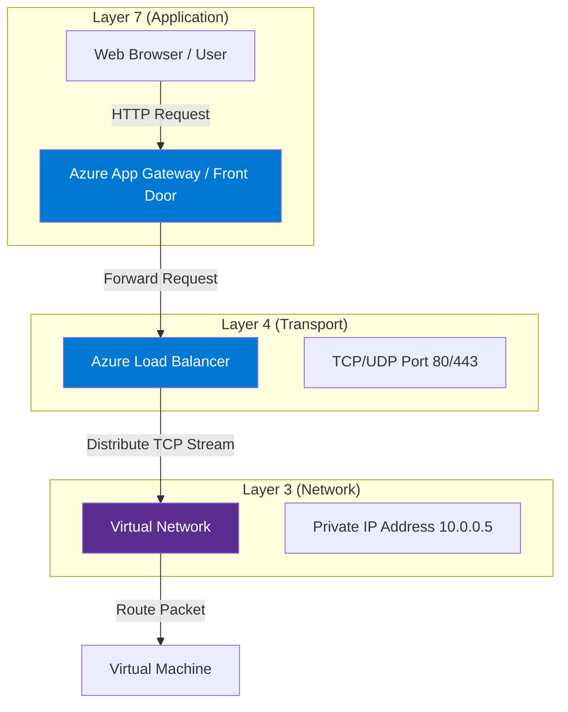

# 🌐 OSI Model (Open Systems Interconnection)

## 📌 Overview

The **OSI Model** is a conceptual framework used to understand how data travels across a network. It breaks down network communication into **7 abstract layers**.

> **Mnemonic**: **P**lease **D**o **N**ot **T**hrow **S**ausage **P**izza **A**way
> (Physical, Data Link, Network, Transport, Session, Presentation, Application)
>
> **Hindi Mnemonic: A**ndhra **P**radesh **S**e **T**rain **N**ayi **D**elhi **P**ahuchi
> (Application, Presentation, Session, Transport, Network, Data Link, Physical)

---

## 1. The 7 Layers & Azure Mapping

| Layer        | Name                   | Unit of Data | Function                             | Azure Component                                     |
| :----------- | :--------------------- | :----------- | :----------------------------------- | :-------------------------------------------------- |
| **L7** | **Application**  | Data         | End-user interface (HTTP, FTP, SMTP) | **Application Gateway**, **Front Door** |
| **L6** | **Presentation** | Data         | Encryption, Compression (SSL/TLS)    | **SSL Termination**                           |
| **L5** | **Session**      | Data         | Session management                   | TCP Sessions                                        |
| **L4** | **Transport**    | Segment      | Reliability, Ports (TCP/UDP)         | **Azure Load Balancer**                       |
| **L3** | **Network**      | Packet       | Routing, IP Addressing               | **Virtual Network (VNET)**, **NSG**     |
| **L2** | **Data Link**    | Frame        | MAC Addressing, Switching            | Virtual Switch (Managed by Azure)                   |
| **L1** | **Physical**     | Bit          | Cables, Fiber, Wireless              | Physical Data Center Hardware                       |

---

## 2. Key Azure Scenarios

### L4 vs L7 Load Balancing

- **L4 (Transport Layer)**:

  - **Azure Load Balancer**: Distributes traffic based on **IP Address + Port** (5-tuple hash). Use this for non-HTTP traffic (e.g., SQL Server, TCP streams).
  - _It doesn't "look" inside the packet._
- **L7 (Application Layer)**:

  - **Azure Application Gateway**: Distributes traffic based on **URL request**.
  - Example: Request for `/images` goes to Server A, request for `/video` goes to Server B.
  - _It "understands" the HTTP request._

---

## 3. Architecture Diagram

---

## 💡 Exam Tips for AZ-900

- **Azure Load Balancer**: Works at **Layer 4** (Transport).
- **Application Gateway**: Works at **Layer 7** (Application) and includes WAF (Web Application Firewall).
- **NSG (Network Security Group)**: Filters traffic at **Layer 3 & 4** (IP and Port).
