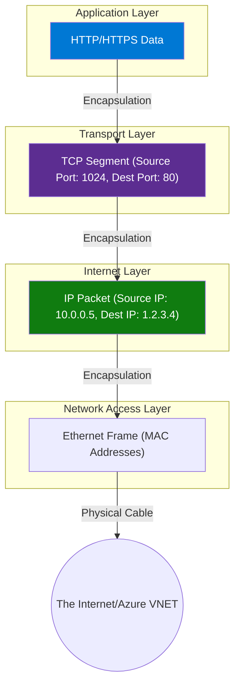

# 🌐 TCP/IP Model (Transmission Control Protocol/Internet Protocol)

## 📌 Overview

The **TCP/IP Model** (also known as the Internet Protocol Suite) is the practical implementation of networking used by the internet today. Unlike the theoretical 7-layer OSI model, TCP/IP simplifies networking into **4 layers**.

---

## 1. The 4 Layers & OSI Comparison

| TCP/IP Layer          | OSI Layer Mapping                  | Function                         | Protocol Examples | Azure Component                 |
| :-------------------- | :--------------------------------- | :------------------------------- | :---------------- | :------------------------------ |
| **Application**       | Application, Presentation, Session | User interface & data formatting | HTTP, DNS, SSH    | **App Gateway**, **Front Door** |
| **Transport**         | Transport                          | Reliability & Flow Control       | TCP, UDP          | **Azure Load Balancer**         |
| **Internet**          | Network                            | Logical Addressing & Routing     | IP, ICMP          | **Virtual Network (VNET)**      |
| **Network Interface** | Data Link, Physical                | Physical Hardware & MAC          | Ethernet, Wi-Fi   | **NIC**, **ExpressRoute**       |

---

## 2. Key Concepts

### 📨 Encapsulation

As data moves down the stack, each layer adds a "Header" (Envelope).

1. **Application**: Data (user payload).
2. **Transport**: Adds TCP Header (Source/Dest Port). -> _Segment_
3. **Internet**: Adds IP Header (Source/Dest IP). -> _Packet_
4. **Network Interface**: Adds MAC Header/Trailer. -> _Frame_

### 🤝 TCP vs UDP (Transport Layer)

- **TCP (Transmission Control Protocol)**:
  - **Reliable**: Guarantees delivery (Ack).
  - **Ordered**: Packets arrive in order.
  - **Heavy**: Slower.
  - **Use Case**: Web browsing (HTTP), Email (SMTP), Azure SQL Database connect.
- **UDP (User Datagram Protocol)**:
  - **Unreliable**: Fire and forget (No Ack).
  - **Fast**: Low latency.
  - **Use Case**: Streaming, Gaming, DNS queries.

---

## 3. Architecture Diagram

---

---

## 💡 Hinglish Explanation (Courier System)

### **1. Application Layer (Letter Likhna)**

- **Hinglish**: Aapne letter (HTTP Data) likha aur envelope mein dala.

### **2. Transport Layer (Receipt)**

- **Hinglish (TCP)**: Courier wale ne kaha "Main pakka pahunchaunga aur sign lunga". (Reliable).
- **Hinglish (UDP)**: Courier wale ne kaha "Main phek ke chala jaunga, mila toh mila". (Fast but Unreliable).

### **3. Internet Layer (Address)**

- **Hinglish**: Envelope pe "To: Delhi, From: Mumbai" (IP Address) likha taaki sahi shehar pahunche.

### **4. Network Interface (Gadi)**

- **Hinglish**: Actual truck ya train (Ethernet/Wi-Fi) jo physical letter ko lekar gayi.

---

## 💡 Exam Tips for AZ-900

- **TCP/IP** is the real-world model; **OSI** is the reference model.
- **Azure Diagram**:
  - **App Gateway** = Application Layer.
  - **Load Balancer** = Transport Layer.
  - **VNET/Router** = Internet Layer.
