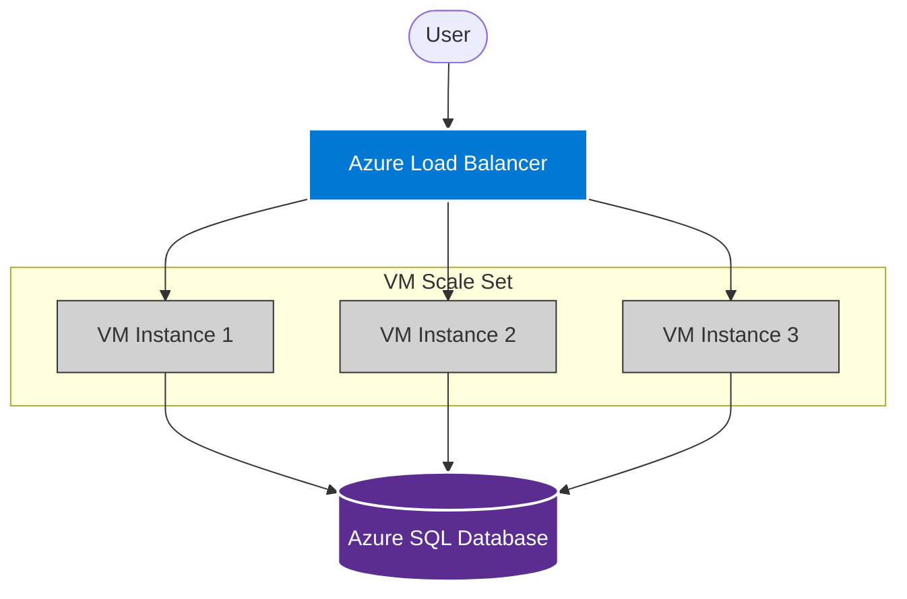

# ⚖️ Azure Virtual Machine Scale Sets (VMSS)

## 📌 Overview

**Azure Virtual Machine Scale Sets (VMSS)** allow you to **create and manage a group of identical, load-balanced VMs**. The number of VM instances can **automatically increase or decrease in response to demand or a defined schedule**.

- **Key Benefit**: Provides high availability to your applications and allows you to centrally manage, configure, and update a large number of VMs.
- **Scenario**: You have a web application. During the day, you need 10 VMs to handle traffic. At night, you only need 2. VMSS handles this automatically.

---

## 1. Scale Modes

### ↕️ Vertical Scaling (Scale Up/Down)

Changing the size of the virtual machine (e.g., from `Standard_D2` to `Standard_D4`).

- **Requires Downtime**: The VM must be restarted to resize.
- **Use Case**: Your database needs more RAM permanently.

### ↔️ Horizontal Scaling (Scale Out/In)

Changing the number of instances (e.g., from 2 VMs to 5 VMs).

- **No Downtime**: New VMs are added while the application keeps running.
- **Use Case**: Web applications, Microservices. **VMSS uses Horizontal Scaling**.

---

## 2. Orchestration Modes 🎻

Azure VMSS provides two ways to manage the instances:

### 🅰️ Uniform Orchestration (Review the "Classic" VMSS)

This is the standard mode familiar to most users.

- **Characteristics**: Uses identical VM instances (same image, same size) from a central configuration.
- **Management**: You manage the _Scale Set_, not individual VMs.
- **Pros**: Easy to scale to 1,000s of VMs; faster provisioning; perfect for stateless stateless workloads.
- **Cons**: Less flexibility if you need to tweak one specific VM.

### 🅱️ Flexible Orchestration (The New Standard)

Brings the best of Scale Sets and Availability Sets together.

- **Characteristics**: Treats VMs like standard Azure IaaS VMs but groups them for scaling. You can mix different VM types or Spot instances.
- **Management**: You have full control over the individual NICs and Disks of the VMs.
- **Pros**: High Availability (spread across Fault Domains); Easier troubleshooting; Fast scaling.
- **Recommendation**: Microsoft recommends **Flexible** mode for most new workloads.

---

## 3. How VMSS Works

1. **Golden Image**: You provide a standard VM image (e.g., Ubuntu web server with Nginx installed) or a Custom Image (AMI equivalent).
2. **Configuration**: You set the "Instance Count" or "Autoscale Rules".
3. **Load Balancer**: A Load Balancer usually sits in front of the VMSS to distribute traffic to all healthy instances.

### 🧠 Autoscale Rules

You define _when_ to add/remove VMs.

- **Metric-based**: "If Average CPU > 75% for 5 minutes, Add 1 VM."
- **Time-based**: "Every morning at 8 AM, increase to 10 instances."

### 📐 Architecture Diagram

---

## 3. Availability & Fault Tolerance

VMSS automatically distributes instances across:

- **Fault Domains** (Racks with separate power/network).
- **Update Domains** (Groups of VMs that can be rebooted together for patching).
- **Availability Zones** (Different physical datacenters within a region).

> **Note**: An **Availability Set** is a similar concept but requires you to manage the VMs individually. **VMSS** manages them as a set.

---

## 💡 Exam Tips for AZ-900

- **Scale Sets** = "Identical VMs" + "Autoscaling".
- **Vertical Scaling** = "Resize VM" (Downtime).
- **Horizontal Scaling** = "Add more VMs" (No Downtime).
- **Elasticity** = The property of VMSS to scale automatically.
