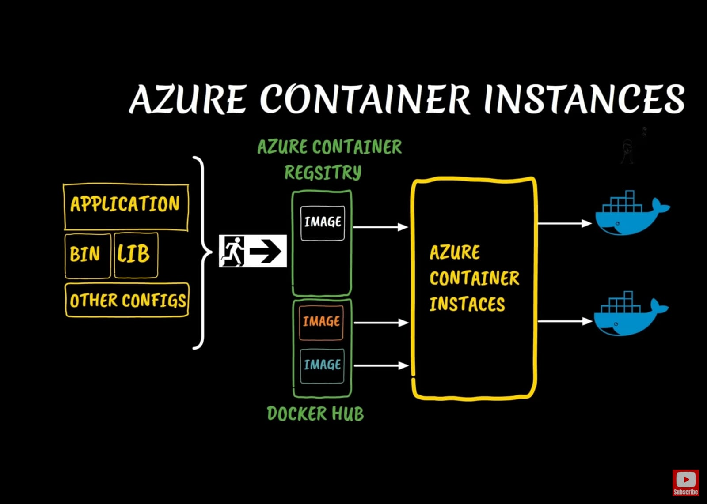
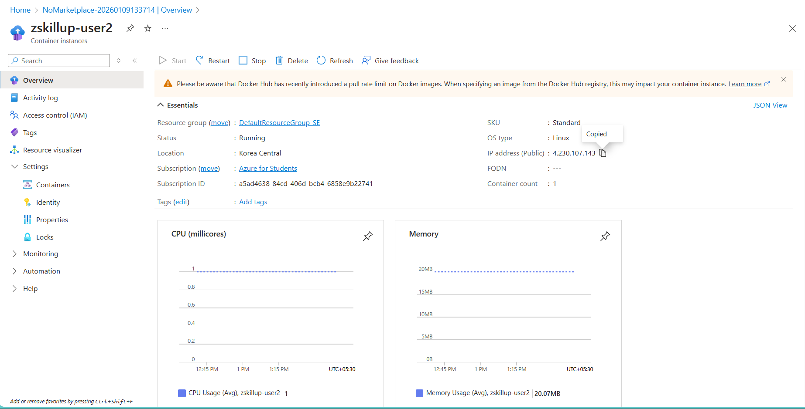

# 📦 Azure Container Instances (ACI)

## 📌 Overview

**Azure Container Instances (ACI)** is the fastest and simplest way to run a container in Azure, without having to manage any virtual machines or adopt a higher-level service like Kubernetes.

- **Type**: Serverless Containers (PaaS).
- **Billing**: Per-second billing based on how long the container runs.
- **Boot Time**: Seconds.

---

## 1. Key Concepts

### 🚀 Serverless

You don't worry about the underlying server. You just say "Here is my Docker Image, run it with 2 CPU and 4 GB RAM." Azure handles the rest.

### 👥 Container Groups

The top-level resource in ACI is a **Container Group**.

- Usually contains 1 container.
- Can contain multiple containers (sidecars) that share the same:
  - Lifecycle (start/stop together).
  - Local network (localhost).
  - Storage volumes.

### 🔄 Restart Policies

- **Always**: Keep restarting if it crashes (Good for web servers).
- **OnFailure**: Restart only if it fails (Good for batch jobs).
- **Never**: Run once and stop (Good for one-off tasks).

---

## 3. Serverless Architecture

```text
    USER / SCRIPT             AZURE CLOUD
    =============            =============

   +-------------+          +------------------------+
   |  Run Command|  ----->  | Azure Container Engine |
   | (Az CLI)    |          | (Serverless Management)|
   +-------------+          +------------------------+
                                        |
       (No VM to Manage)                v
                            +------------------------+
                            | [+] MyContainer        |
                            |     (App + Libs)       |
                            |     [ Public IP ]      |
                            +------------------------+
```

## 

## 2. Use Cases

1.  **Event-Driven Applications**: Run a script when a file is uploaded to Storage.
2.  **Data Processing Jobs**: Crunch numbers for 10 minutes and then stop.
3.  **Bursting from AKS**: If your Kubernetes cluster is full, you can "burst" extra pods into ACI (Virtual Nodes).
4.  **Dev/Test**: Quickly test a new container image.

---

## 3. 🛠️ Hands-on: Create ACI with Azure CLI

### Step 1: Create a Container

Run a public Nginx image.

```bash
az container create \
  --resource-group myResourceGroup \
  --name myContainer \
  --image nginx \
  --ports 80 \
  --dns-name-label my-unique-app-dns
```


### Step 2: Verify it Works

Get the URL (FQDN) of your container.

```bash
az container show \
  --resource-group myResourceGroup \
  --name myContainer \
  --query ipAddress.fqdn \
  --output tsv
```



### Step 3: View Logs

See what's happening inside.

```bash
az container logs --resource-group myResourceGroup --name myContainer
```


### Step 4: Delete

```bash
az container delete --resource-group myResourceGroup --name myContainer
```

## 

## 💡 Exam Tips for AZ-900

- **Simplest Way**: ACI is the "Simplest" way to run a container.
- **No Orchestration**: If you need scaling, auto-healing, or complex networking, use **AKS**. If you just need to run "x", use **ACI**.
- **Per-Second Billing**: Great for short-lived tasks.
