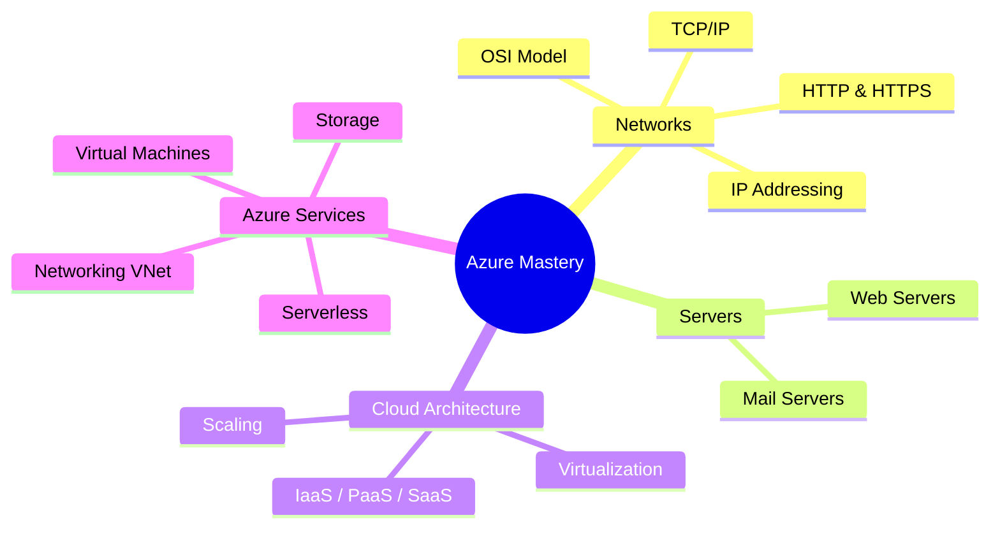

# ☁️ Azure Cloud & Networking Mastery


> **"From Packet Switching to Cloud Scaling"** — A comprehensive journey through Computer Networks, Server Architecture, and Azure Cloud Services.

---

## 🗺️ Learning Path



---

## 📂 Directory Structure

```text
.
├── 🌐 computer_networks/   # The Foundation (IP, TCP, HTTP)
├── ☁️ cloud_computing/     # Core Cloud Concepts
├── 🖥️ servers/             # Web & Mail Architectures
├── 🏗️ app_architecture/    # System Design (Microservices)
└── 🔷 azure_services/      # Deep Dive into Azure Resources
```

---

## 🌐 1. Computer Networks

Foundational knowledge required to understand how the Cloud communicates.

| Module                | Key Concepts                              | Quick Link                                                 |
| :-------------------- | :---------------------------------------- | :--------------------------------------------------------- |
| **Area Networks**     | LAN, WAN, VPN, SAN                        | [View Guide](computer_networks/00_area_networks.md)        |
| **IP Addresses**      | IPv4 vs IPv6, Public vs Private, CIDR     | [View Guide](computer_networks/00_ip_addresses.md)         |
| **MAC Address**       | Physical Address, OUI, Layer 2            | [View Guide](computer_networks/00_mac_address.md)          |
| **Network Arch**      | Topologies, Client-Server, N-Tier         | [View Guide](computer_networks/00_network_architecture.md) |
| **Networking Models** | Peer-to-Peer vs Client-Server             | [View Guide](computer_networks/00_networking_models.md)    |
| **Ports & Protocols** | HTTP (80), HTTPS (443), SSH (22)          | [View Guide](computer_networks/00_networking_ports.md)     |
| **OSI Model**         | 7 Layers of Communication                 | [View Guide](computer_networks/00_osi_model.md)            |
| **TCP/IP Model**      | 4 Layers, TCP vs UDP                      | [View Guide](computer_networks/00_tcp_ip_model.md)         |
| **HTTP vs HTTPS**     | **NEW!** Headers, Status Codes, Handshake | [View Guide](computer_networks/00_http_vs_https.md)        |

<details>
<summary><strong>🔽 Click to Expand Detailed Summaries (English & Hinglish)</strong></summary>

### Area Networks

- **🇬🇧 English**: Covers LAN (Local), WAN (Global), VPN (Secure Tunnel), SAN (Storage), PAN (Personal).
- **🇮🇳 Hinglish**: LAN ek building mein, WAN poori duniya mein. VPN ek "invisible pipe" hai security ke liye.

### IP Addresses

- **🇬🇧 English**: Unique ID for devices. IPv4 is old (32-bit), IPv6 is new (128-bit). Private IPs stay local.
- **🇮🇳 Hinglish**: Ghar ka pata (Address). Public matlab duniya ke liye, Private matlab ghar ke andar.

### MAC Address

- **🇬🇧 English**: Hard-coded ID on Network Card. Layer 2. Never changes like a fingerprint.
- **🇮🇳 Hinglish**: Computer ka Fingerprint. IP badal sakti hai, MAC nahi.

### HTTP vs HTTPS

- **🇬🇧 English**: HTTP is plain text (unsafe). HTTPS uses SSL/TLS encryption (lock icon).
- **🇮🇳 Hinglish**: HTTP khula postcard hai. HTTPS band lifafa (envelope) hai.

_(See individual files for full 5-point breakdowns)_

</details>

---

## ☁️ 2. Cloud Computing

Understanding the "Why" and "How" of the Cloud.

| Module                    | Key Concepts                      | Quick Link                                                |
| :------------------------ | :-------------------------------- | :-------------------------------------------------------- |
| **Cloud Benefits**        | High Availability, Agility, OpEx  | [View Guide](cloud_computing/00_cloud_benefits.md)        |
| **Deployment Models**     | Public, Private, Hybrid           | [View Guide](cloud_computing/00_deployment_models.md)     |
| **Scaling**               | Vertical (Up) vs Horizontal (Out) | [View Guide](cloud_computing/00_scaling.md)               |
| **Service Models**        | IaaS, PaaS, SaaS                  | [View Guide](cloud_computing/00_service_models.md)        |
| **Shared Responsibility** | Who secures what?                 | [View Guide](cloud_computing/00_shared_responsibility.md) |
| **Virtualization**        | Hypervisors (Type 1 & 2)          | [View Guide](cloud_computing/00_virtualization.md)        |

<details>
<summary><strong>🔽 Click to Expand Detailed Summaries (English & Hinglish)</strong></summary>

### Scaling

- **🇬🇧 English**: Scale Up (Vertical) adds RAM. Scale Out (Horizontal) adds Machines. Auto-scaling automates this.
- **🇮🇳 Hinglish**: Vertical matlab ek aadmi ko taakatwar banana. Horizontal matlab 10 aadmi laga dena.

### Service Models

- **🇬🇧 English**: **IaaS** (Rent VM), **PaaS** (Rent Runtime), **SaaS** (Rent App).
- **🇮🇳 Hinglish**: **IaaS** (Ingredients lao), **PaaS** (Pizza order karo), **SaaS** (Restaurant mein khao).

</details>

---

## 🖥️ 3. Servers & Architecture

| Module               | Key Concepts                   | Quick Link                                                     |
| :------------------- | :----------------------------- | :------------------------------------------------------------- |
| **Server Types**     | Web (HTTP) vs Mail (SMTP/IMAP) | [View Guide](servers/00_server_types.md)                       |
| **App Architecture** | Monolith vs Microservices      | [View Guide](app_architecture/00_monolith_vs_microservices.md) |
| **State**            | Stateful vs Stateless Apps     | [View Guide](app_architecture/00_stateful_applications.md)     |

<details>
<summary><strong>🔽 Click to Expand Detailed Summaries (English & Hinglish)</strong></summary>

### Server Types

- **🇬🇧 English**: Web Server delivers pages. Mail Server sends (SMTP) and stores (IMAP) emails.
- **🇮🇳 Hinglish**: Web Server 'Restaurant' hai. Mail Server 'Post Office' hai.

### Monolith vs Microservices

- **🇬🇧 English**: Monolith is one big file. Microservices are many small, communicating parts.
- **🇮🇳 Hinglish**: Monolith ek bada pathar hai. Microservices chote chote eent (bricks) hain.

</details>

---

## 🔷 4. Azure Services

Deep dives into specific Azure Resources.

| #      | Service              | Description                        | Quick Link                                             |
| :----- | :------------------- | :--------------------------------- | :----------------------------------------------------- |
| **01** | **Hierarchy**        | Mgmt Group > Sub > RG > Resource   | [View](azure_services/01_resource_hierarchy.md)        |
| **02** | **Resource Groups**  | Logical Containers for resources   | [View](azure_services/02_resource_groups.md)           |
| **03** | **Virtual Machines** | Infrastructure as a Service (IaaS) | [View](azure_services/03_virtual_machines.md)          |
| **04** | **Storage**          | Blob, File, Queue, Table           | [View](azure_services/04_storage_services.md)          |
| **05** | **Scale Sets**       | Auto-scaling groups of VMs         | [View](azure_services/05_vm_scale_sets.md)             |
| **06** | **AVD**              | Azure Virtual Desktop              | [View](azure_services/06_azure_virtual_desktop.md)     |
| **07** | **Containers**       | Azure Container Instances (ACI)    | [View](azure_services/07_azure_container_instances.md) |
| **08** | **Functions**        | Serverless Compute (Event-driven)  | [View](azure_services/08_azure_functions.md)           |
| **09** | **VNet**             | Virtual Networks & Peering         | [View](azure_services/09_virtual_networks.md)          |
| **10** | **Subnets**          | Network Segmentation               | [View](azure_services/10_subnets.md)                   |

<details>
<summary><strong>🔽 Click to Expand Detailed Summaries (English & Hinglish)</strong></summary>

### Virtual Machines

- **🇬🇧 English**: Renting a computer in the cloud. You manage updates.
- **🇮🇳 Hinglish**: Cloud par kiraye ka computer.

### Azure Functions

- **🇬🇧 English**: Serverless. Run code only when triggered. Pay per execution.
- **🇮🇳 Hinglish**: Sirf code likho, server ka tension nahi.

</details>

---

## 🛠️ How to Run Locally

This documentation is built with a custom **Node.js** static site generator.

1.  **Install Dependencies**:
    ```bash
    cd doc_web
    npm install
    ```
2.  **Build & Serve**:
    ```bash
    npm run serve
    ```
3.  **Visit**: `http://localhost:3000`

---

_Created by Priyanshu_
