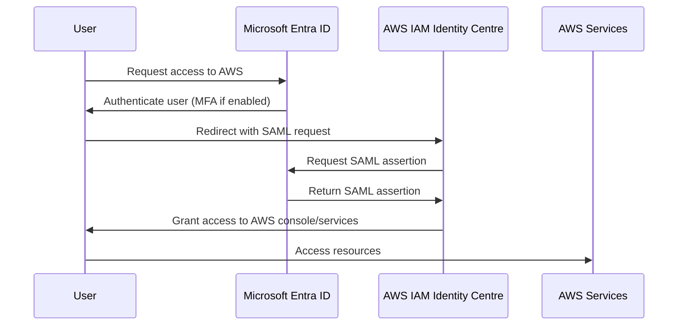

# Microsoft Entra ID

## Overview

Microsoft Entra ID (formerly Azure Active Directory) is Microsoft's cloud-based identity and access management (IAM) service. It provides secure access to applications, devices, and data, enabling organizations to manage user identities and control access across cloud and on-premises environments.

## Key Features

- **Single Sign-On (SSO)**: Allows users to access multiple applications with a single set of credentials.
- **Multi-Factor Authentication (MFA)**: Adds an extra layer of security by requiring additional verification.
- **Conditional Access**: Enables policies to control access based on conditions like user location, device state, and risk level.
- **Identity Protection**: Detects and responds to identity risks using machine learning.
- **Application Management**: Integrates with thousands of SaaS applications and supports custom app development.
- **Device Management**: Manages and secures devices accessing corporate resources.

## Components

- **Users and Groups**: Manage user accounts and group memberships.
- **Tenants**: Isolated instances for organizations.
- **Domains**: Custom domains for branding and user experience.
- **Roles and Permissions**: Define roles for administrative tasks.

## Integration with Azure Services

Microsoft Entra ID integrates seamlessly with other Azure services, providing centralized identity management for resources like Azure VMs, storage accounts, and applications deployed on Azure.

## Integration with AWS IAM Identity Centre

Microsoft Entra ID can be integrated with AWS IAM Identity Centre (formerly AWS SSO) to enable seamless single sign-on (SSO) between Azure and AWS environments. This allows users to access AWS resources using their Entra ID credentials.

### Key Benefits

- Unified identity management across cloud platforms.
- Enhanced security through centralized authentication.
- Simplified user experience with SSO.

### Configuration Steps

1. **Set up SAML Application in Microsoft Entra ID**:
   - Navigate to the Azure portal and create a new Enterprise Application.
   - Choose "Non-gallery application" and name it (e.g., "AWS IAM Identity Centre").
   - Configure SAML settings:
     - Identifier (Entity ID): `urn:amazon:webservices`
     - Reply URL: `https://signin.aws.amazon.com/saml`
   - Download the SAML metadata XML from Entra ID.

2. **Configure Identity Provider in AWS IAM Identity Centre**:
   - In the AWS Management Console, go to IAM Identity Centre.
   - Add a new identity provider.
   - Upload the SAML metadata from Entra ID.
   - Set up attribute mappings (e.g., email, name).

3. **Assign Users and Groups**:
   - In Entra ID, assign users/groups to the AWS application.
   - In IAM Identity Centre, create permission sets and assign them to users.

4. **Test the Integration**:
   - Users can now log in to AWS via the Entra ID portal.

### Metadata Exchange

- **Entra ID Metadata**: The SAML metadata XML contains the signing certificate, entity ID, and endpoints. This is downloaded from the Entra ID application configuration.
- **AWS Metadata**: AWS provides its own metadata URL for the identity provider configuration, but for Entra ID as IdP, you upload Entra's metadata to AWS.

For detailed guides, refer to:
- [Microsoft Documentation: Integrate with AWS](https://learn.microsoft.com/en-us/entra/identity/saas-apps/aws-single-sign-on-tutorial)
- [AWS Documentation: SAML Federation](https://docs.aws.amazon.com/singlesignon/latest/userguide/saml.html)

### SSO Flow Diagram

## Getting Started

To use Microsoft Entra ID:
1. Create an Azure account if you don't have one.
2. Set up a Microsoft Entra ID tenant.
3. Add users and assign roles.
4. Configure applications and access policies.

For more information, visit the [official Microsoft Entra ID documentation](https://learn.microsoft.com/en-us/entra/).