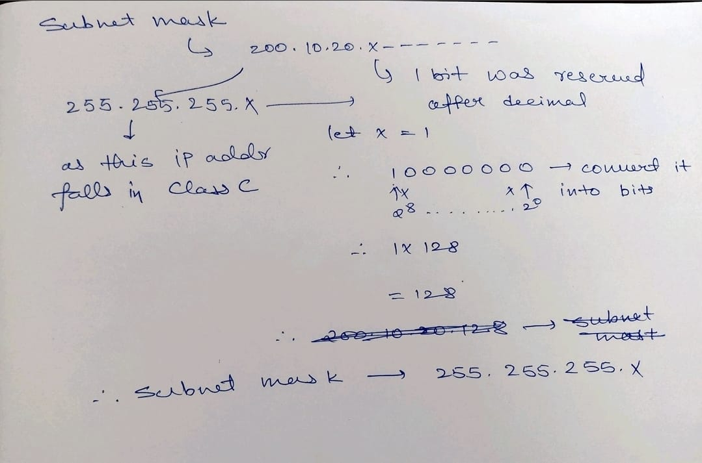

# 🎭 Subnet Mask: The Complete Guide

## 📌 Definition

A **Subnet Mask** is a 32-bit number that accompanies an IP address. It has one specific job: **To tell the computer which part of the IP address is the "Network" and which part is the "Host".**

Without a Subnet Mask, an IP address is just a meaningless string of numbers. The mask gives it context.

---

## ⚡ How It Works (The Logic)

The Subnet Mask works like a filter (or a mask) using Binary logic.

- **1s (Ones)**: These represent the **Network Portion**. These bits are **LOCKED**. You cannot change them.
- **0s (Zeros)**: These represent the **Host Portion**. These bits are **OPEN**. You can assign these to your computers.

### Binary Visualization

Let's look at a standard **Class C** mask: `255.255.255.0`

| Format      | Octet 1      | Octet 2      | Octet 3      | Octet 4      |
| :---------- | :----------- | :----------- | :----------- | :----------- |
| **Decimal** | 255          | 255          | 255          | 0            |
| **Binary**  | **11111111** | **11111111** | **11111111** | **00000000** |
| **Meaning** | Network 🔒   | Network 🔒   | Network 🔒   | Host 🔓      |

**What this tells the router**:
"Any IP address that matches these first 3 octets is on **MY LOCAL NETWORK**. Anything else? Send it to the Gateway."

---

## 💡 Hinglish Analogy (The Painting Mask)

Imagine you are painting a wall, but you don't want to paint over the window frame. What do you do? You put **Masking Tape** on it.

- **The IP Address**: The Wall.
- **The Subnet Mask**: The Masking Tape.
- **Network Bits (1s)**: Where the tape is applied. You **CANNOT** paint here. (Fixed).
- **Host Bits (0s)**: Where the wall is exposed. You **CAN** paint here. (Variable).

> "Jahan '1' hai wahan tape laga hai, kuch mat karo. Jahan '0' hai wahan tumhara raaj hai."

---

## 📦 Default Subnet Masks (Classes)

Before CIDR, we had Classes. These are still the default masks for these IP ranges.

| Class | Range Starts With | Default Mask    | CIDR  | Format    |
| :---- | :---------------- | :-------------- | :---- | :-------- |
| **A** | 1 - 126           | `255.0.0.0`     | `/8`  | `N.H.H.H` |
| **B** | 128 - 191         | `255.255.0.0`   | `/16` | `N.N.H.H` |
| **C** | 192 - 223         | `255.255.255.0` | `/24` | `N.N.N.H` |

---

## 🧮 How to Calculate Subnet Mask (Step-by-Step)

If someone gives you a CIDR (e.g., `/26`), how do you get the mask (`255.255.255.192`)?

### Step 1: Find the "Interesting Octet"

Where does the CIDR number stop?

- **/1 - /8**: 1st Octet
- **/9 - /16**: 2nd Octet
- **/17 - /24**: 3rd Octet
- **/25 - /32**: 4th Octet

**Example: /26** -> Falls in the **4th Octet** (It's more than 24, less than 32).
So the first 3 octets are full (`255.255.255.x`).

### Step 2: Calculate "On" Bits in that Octet

Subtract the previous boundary from your CIDR.

- **Formula**: `CIDR - 24` (for 4th octet)
- **Math**: `26 - 24 = 2`
- So, the 4th octet has **2 bits turned ON**. (`11000000`)

### Step 3: Add the Values

Use the Magic Table:
`| 128 | 64 | 32 | 16 | 8 | 4 | 2 | 1 |`

- Add the first 2 values: `128 + 64 = 192`.

**Result**: `255.255.255.192`

---

## My Handwritten Notes

## ⚡ Exam Tips

1.  **ANDing**: The Router performs a logical **AND** operation between the IP and the Mask to find the **Network ID**.
2.  **Length**: A Subnet Mask is **ALWAYS** 32 bits long.
3.  **Contiguous 1s**: A valid subnet mask must have a continuous stream of 1s followed by 0s. You cannot have `11011...`.
