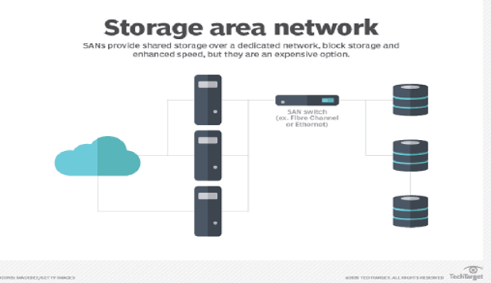

# 💾 Storage Types: DAS, NAS, SAN

## 📌 Overview

Storage is where data serves live. In a server environment, how the storage is connected to the computer determines its type, performance, and use case. The three main types are **DAS**, **NAS**, and **SAN**.

---

## 🔌 1. DAS (Direct Attached Storage)

**DAS** is **storage directly attached to the server or computer without a network** in between.

### Architecture Flow

```text
    +-------------+          +-------------+
    |  Server A   |          |  Server B   |
    +------+------+          +------+------+
           |                        |
      (SATA/SAS)               (SATA/SAS)
           |                        |
    +------+------+          +------+------+
    |  Hard Disk  |          |  Hard Disk  |
    +-------------+          +-------------+
    (Only Server A           (Only Server B
     can access)              can access)
```

### 📋 Detailed Breakdown

- **Protocols**:
  - **SATA** (Serial ATA): Common in desktops/laptops.
  - **SAS** (Serial Attached SCSI): Enterprise grade, faster.
  - **USB** (Universal Serial Bus): External drives.
  - **NVMe** (Non-Volatile Memory Express): Ultra-fast direct connection via PCIe.

- **Key Features**:
  - **1:1 Relationship**: One disk connected to one server.
  - **No Network**: Data travels via direct cables, not LAN/WAN.
  - **Block Level Access**: The OS sees it as a raw physical disk (C: Drive).

- **✅ Benefits**:
  - **Simplicity**: Plug and Play. Easy to configure.
  - **Low Latency**: No network hops means very fast response time.
  - **Cost**: Cheapest option. No expensive switches or routers needed.

- **❌ Limitations**:
  - **Siloed Data**: Data cannot be easily shared with other servers.
  - **Scalability**: Limited by the number of slots/ports in the server chassis.

- **🏢 Common Uses**:
  - Laptop/Desktop internal storage.
  - Small businesses with single-server setups.
  - Boot drives for OS installation.

---

## 🔗 2. NAS (Network Attached Storage)

**NAS** is a dedicated file **storage server connected to a network**. It allows **multiple servers/users to share files** over the LAN.

### Architecture Flow

```text
       +----------+         +----------+
       | Server A |         | Server B |
       +----+-----+         +----+-----+
            |                    |
            +---------+----------+
                      | (Ethernet / LAN)
                      v
             +--------+--------+
             |   NAS Device    |
             | (Shared Files)  |
             +-----------------+
```


### 📋 Detailed Breakdown

- **Protocols**:
  - **NFS** (Network File System): Standard for Linux/Unix.
  - **SMB/CIFS** (Server Message Block): Standard for Windows.
  - **AFP** (Apple Filing Protocol): Standard for macOS.

- **Key Features**:
  - **File Level Access**: You access files and folders, not raw disk blocks.
  - **Network Based**: Connected via standard Ethernet (RJ45).
  - **OS Optimized**: Runs a stripped-down OS optimized for file serving.

- **✅ Benefits**:
  - **Collaboration**: Easy file sharing among many users.
  - **Central Management**: All data in one place, easy to backup.
  - **Accessibility**: Can be accessed by any device on the network (Phone, PC, TV).

- **❌ Limitations**:
  - **Performance**: Dependent on network speed (1Gbps/10Gbps) and traffic.
  - **Latency**: Higher latency compared to DAS/SAN due to network overhead.

- **🏢 Common Uses**:
  - Office File Shares (User Home Directories).
  - Media Streaming Servers (Plex).
  - Storing Backups and Archives.

---

## ⚡ 3. SAN (Storage Area Network)

**SAN** is a **high-speed**, **dedicated network that provides block-level access to storage**. It makes remote storage look like a local disk to the server.

### Architecture Flow

```text
       +----------+         +----------+
       | Server A |         | Server B |
       +----+-----+         +----+-----+
            | (Fiber Channel)    |
            +---------+----------+
                      |
             +--------+--------+
             |   SAN Switch    |
             +--------+--------+
                      |
           +----------+----------+
           |    Storage Array    |
           | (Raw Block Storage) |
           +---------------------+
```



---

### 📋 Detailed Breakdown

- **Protocols**:
  - **FCP** (Fibre Channel Protocol): Specialized high-speed optical network (8Gbps - 128Gbps).
  - **iSCSI** (Internet Small Computer System Interface): Uses standard Ethernet but sends block commands.
  - **FCoE** (Fibre Channel over Ethernet): Converges FC and Ethernet.

- **Key Features**:
  - **Block Level Access**: Server sees a "Local Disk" in Disk Management, even though it's miles away.
  - **Dedicated Network**: Traffic is separated from normal user LAN traffic (No lag from YouTube videos).
  - **Redundancy**: Multiple paths (Multipathing) ensure if one cable breaks, data still flows.

- **✅ Benefits**:
  - **Extreme Speed**: Low latency and high throughput.
  - **High Availability**: Crucial for clustering (if Server A fails, Server B can mount the same disk).
  - **Scalability**: Add petabytes of storage without touching the servers.

- **❌ Limitations**:
  - **Cost**: Very expensive hardware (FC Switches, HBAs).
  - **Complexity**: Requires specialized skills to manage (Storage Admins).

- **🏢 Common Uses**:
  - Enterprise Databases (Oracle, SQL Server).
  - Virtualization Farms (VMware ESXi, Hyper-V).
  - Mission-Critical Applications (Banking, Stock Trading).

---

## ⚖️ Comparison: DAS vs NAS vs SAN

| Feature        | DAS (Direct)            | NAS (Network)                | SAN (Network)             |
| :------------- | :---------------------- | :--------------------------- | :------------------------ |
| **Full Form**  | Direct Attached Storage | Network Attached Storage     | Storage Area Network      |
| **Data Type**  | **Block** (Raw Disk)    | **File** (Shared Folder)     | **Block** (Raw Disk)      |
| **Connection** | SATA / SAS / USB        | Ethernet (LAN)               | Fiber Channel (FC)        |
| **Protocol**   | SCSI / SATA / NVMe      | NFS / SMB / CIFS             | FCP / iSCSI               |
| **Speed**      | Very Fast               | Moderate (Network dependent) | Extremely Fast            |
| **Cost**       | Low                     | Medium                       | High                      |
| **Best For**   | Single PC, Boot OS      | File Sharing, Home Media     | Databases, Virtualization |

## 

## ☁️ Azure Context

How do these map to the Cloud (Azure)?

1. **DAS (Direct)**: **Azure Managed Disks**. Virtual hard drives attached to one VM. Good for OS disks and temporary data.
2. **NAS (File Sharing)**: **Azure Files**. Managed file shares accessible via SMB anywhere. Great for "Lift and Shift" of on-prem file servers.
3. **SAN (High Perf)**: **Azure Elastic SAN** / **Ultra Disks**. For when you need massive IOPS and throughput for top-tier databases.

---

## 💡 Hinglish Explanation

### **1. DAS (My Laptop's Hard Disk)**

- **Hinglish**: DAS wahi hai jo tumhare laptop ke andar laga hua hard disk hai.
- **Simple**: Sirf **MERI** machine use kar sakti hai. Koi aur directly access nahi kar sakta.

### **2. NAS (Google Drive / Shared Folder)**

- **Hinglish**: NAS ek **Shared Folder** hai ghar ke WiFi pe.
- **Simple**: Main bhi photo daal sakta hu, mera bhai bhi ussi folder se photo le sakta hai. **Files share** karne ke liye best hai.

### **3. SAN (Super Fast External Hard Disk via Fiber)**

- **Hinglish**: SAN ek **special high-speed network** hai jo sirf storage ke liye bana hai.
- **Simple**: Ye itna fast hai ki server ko lagta hai disk uske andar hi lagi hai, par asal mein wo door rakhi hoti hai. Badi companies (Amazon, Flipkart) databases ke liye use karti hain.

### **3. SAN (Super Fast External Hard Disk via Fiber)**

- **Hinglish**: SAN ek **special high-speed network** hai jo sirf storage ke liye bana hai.
- **Simple**: Ye itna fast hai ki server ko lagta hai disk uske andar hi lagi hai, par asal mein wo door rakhi hoti hai. Badi companies (Amazon, Flipkart) databases ke liye use karti hain.
