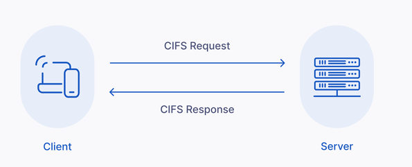

# 📂 CIFS (Common Internet File System)

## 📌 1. Overview

**CIFS (Common Internet File System)** is essentially a version of the **SMB** protocol. It’s used to share files and printers over a network, particularly in Windows environments. Think of it as SMB’s “internet-friendly” form that allows computers to access remote resources as if they were local.

- **Family**: Network file sharing protocol, part of the SMB family.
- **Transport**: Operates over TCP/IP (usually **Port 445**).
- **Status**: Older/Legacy version of SMB.

## 

## 🎯 2. Purpose

- **Remote Access**: Enables access to files, folders, and printers on remote servers.
- **Local Feel**: Makes network resources appear as local drives (e.g., Z: Drive) to users.

### Architecture Flow

```text
    +-------------+                            +-------------+
    |   Client    |                            |   Server    |
    | (Windows PC)|                            | (File Srvr) |
    +-------------+                            +-------------+
           |                                          |
           |                Network (LAN)             |
           +----------------------------------------> |
           |        Request File (\\Server\Share)     |
           |                                          |
           |          Response (File Content)         |
           | <----------------------------------------+
           |                                          |
```

---

## 💻 3. Compatibility

- **Windows**: Native support.
- **Linux/macOS**: Can access CIFS shares using `cifs` or `smb` tools (e.g., `mount.cifs`).

---

## 🆚 4. Difference from SMB

| Feature          | SMB                                         | CIFS                                                                      |
| :--------------- | :------------------------------------------ | :------------------------------------------------------------------------ |
| **Definition**   | Server Message Block (The Protocol Family). | Common Internet File System (A specific version of SMB).                  |
| **Relationship** | The underlying protocol.                    | An older, public version of SMB (SMBv1 era).                              |
| **Usage**        | Modern systems use **SMBv2** or **SMBv3**.  | Legacy term, often used interchangeably but refers to the older standard. |
| **Performance**  | Faster, Secure, WAN-optimized.              | Slower, "Chatty", less secure.                                            |

---

## ⚙️ 5. Typical Usage Example

### Mounting a network folder on Linux

```bash
sudo mount -t cifs //ServerName/SharedFolder /mnt/mountpoint -o username=user
```

---

## 📝 6. Notes

- **Connectivity**: Make sure the server is accessible on the network.
- **Ports**:
  - **445**: Direct TCP (Modern).
  - **139**: NetBIOS (Legacy).
- **Security**: Always use credentials for access.
- **Recommendation**: For modern systems, prefer **SMB2/img/3** over CIFS for speed and security.

---

## 🏢 7. Where to use CIFS?

CIFS is used wherever you need network-based file or printer sharing, especially in environments with Windows or mixed operating systems.

### 1. File Sharing in Local Networks

- Access files on another computer or server over LAN.
- **Example**: Office shared drives, project folders.

### 2. Accessing NAS (Network-Attached Storage)

- Many NAS devices use CIFS/SMB to allow computers to mount storage.
- **Example**: Centralized storage for backups or media.

### 3. Printer Sharing

- Share printers over the network so multiple users can print without direct USB connection.

### 4. Cross-Platform Environments

- CIFS works across Windows, Linux, macOS.

### 5. Home Media Streaming

- Stream videos, music, photos from central server to TV/PC.

### 6. Enterprise Environments

- Centralized file servers (Home directories, Team folders).

> **Key Point**: CIFS is mainly used within **trusted networks** (LANs or VPNs). Exposing CIFS directly to the internet is a security risk.

---

## ✅ 8. Benefits of CIFS

1.  **Easy File Sharing**: Access remote files without physical transfer (USB/Email).
2.  **Cross-Platform**: Works with Windows, Linux, macOS.
3.  **Centralized Storage**: Simplifies backups and management (NAS).
4.  **Security**: Supports authentication (User/Password) and permissions (Read/Write).
5.  **Collaboration**: Multiple users can edit files simultaneously.
6.  **Printer Sharing**: Reduces hardware costs.
7.  **Windows Integration**: Seamless with Active Directory and mapped drives.

---

## 💡 Hinglish Explanation

### **CIFS kya hai?**

- **Hinglish**: CIFS bas **SMB ka purana naam/version** hai.
- **Analogy**: Jaise **"Bombay"** aur **"Mumbai"**. Cheez wahi hai, bas naya naam aur version better hai (SMBv2/v3).
- **Usage**: Jab hum network pe folder share karte hain taaki doosra banda access kar sake, usse CIFS/SMB kehte hain.
